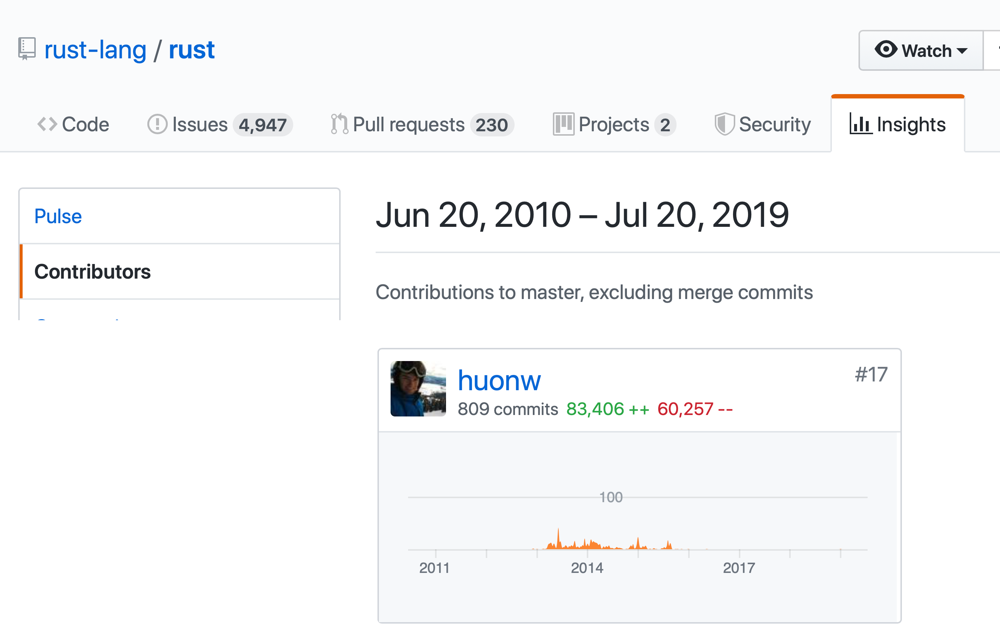
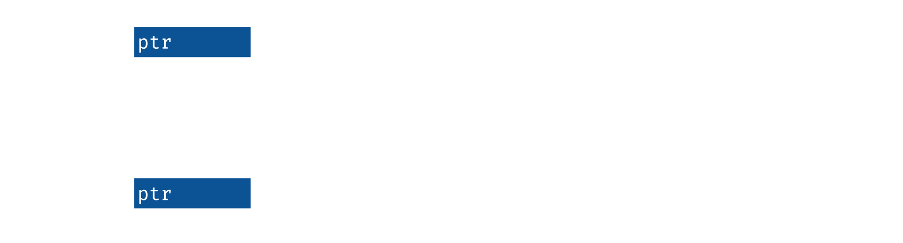
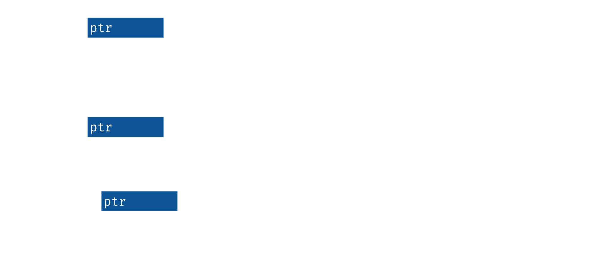

# Learn Rust


Huon Wilson, 2019-08-02

<div class="notes">

70% of security vulnerabilities in Microsoft products were due to the
difficulty humans have writing safe C and C++ code. Rust is a
low-level programming language in the same vein that helps the
computer help us write safe code.

I'm Huon, a software engineer on the platform team of the IA or
stellargraph project, and I've got some experience with Rust, so I'm
going to try to help you take some early steps with it.

</div>

# My Background

- Data61 (last August). Previously: Apple on Swift, Mozilla on Rust
- Dabbled in many programming languages



# Your Background?

- Rust
- **Low-level** <small>(C, C++, assembly)</small>
- **Statically-typed, functional** <small>(Haskell, F#, Scala, OCaml)</small>
- **Statically-typed, object-oriented** <small>(Java, C#, Swift, Scala)</small>
- **Dynamically-typed, scripting** <small>(Javascript, Python, PHP, Ruby, Shell)</small>
- **Other** <small>(TypeScript, Go, Fortran, R, Matlab, SQL, Lisp (Clojure, Common Lisp))</small>

# Structure

<div class="notes">

How are we going to get there? There'll be 3 sets of exercises: first
Rust's approach to resource management, then looking at borrowing, how
we can work with resources without also having to manage them.

</div>

- ⇒ *Introduction*
- Resource Management
- Mutation and Borrowing
-

TODO

# Interlude: Setup

<div class="notes">

Before going forward more, let's get things set up, so that can happen
in parallel and everyone is ready when we get to the first exercise soon.

</div>

TODO: fill out repo name

``` shell
$ git clone https://github.com/huonw/...
$ cd ...
```

``` shell
$ cargo --version
cargo 1.36.0 (c4fcfb725 2019-05-15)
$ cargo run
...
Hello world
```

[rust-lang.org/tools/install](https://rust-lang.org/tools/install)

(These slides in `slides/`)

# Why Rust?

<div class="notes">

MSRC seems to be a formal team designed to deal with security
vulnerabilities in Microsoft products, both retroactively and
proactively. They performed an analysis of Microsoft's CVEs, and
found, consistently, 70% of them were caused by memory safety
problems.

Memory safety is a crucial building block for any other form of
correctness, and violations can result in, at bestm a segfault, or at
worst memory corruption and security vulnerabilities.

For low-level and high-performance programming, C and C++ are typical
choices, and are likely the source of most of those vulnerabilities.

It's very difficult to write safe C and C++ at any scale. This is
despite a plethora of tools now available, such as fuzzers and static
analysers, and is true even with the at a mega-corporation like
Microsoft, that now has consistent and strong investments in software
correctness and safety, such as Haskell and the Midori operating
system.

Rust is designed to be able to solve the same problems as C and C++,
but with memory safety by default, and thus reducing the risk of the
majority of those bugs.

</div>


<div style="text-align: right">

&mdash; [*A Proactive Approach to More Secure Code* Microsoft Security Response Center](https://msrc-blog.microsoft.com/2019/07/16/a-proactive-approach-to-more-secure-code)

</div>


# Buzzwords

<div class="notes">

Rust has a lot of good parts, and here's a quick summary of some words
it uses to describe itself.

It has memory safety, and, uniquely, it does this without a garbage
collector, which is how it targets the same problems as C and C++,
so-called "systems programming". It does this through "affine typing",
and also uses this to get some measure of thread safety.

</div>

> A language empowering everyone to build reliable and efficient
> software. &mdash; [rust-lang.org](https://rust-lang.org)

- **memory safety**, without a garbage collector
- **affine typing**

# Buzzwords

<div class="notes">

Plus, it has a pile of nice things that are common in modern
languages, static types with type inference and algebraic data types,
pattern matching, and generics. It also has hygenic macros,
easy-to-use tooling, and good platform support, including Windows.

All in all, can feel a bit like a blend of C or C++, and Haskell or
OCaml: a low-level language with high-level conveniences.

</div>

> A language empowering everyone to build reliable and efficient
> software. &mdash; [rust-lang.org](https://rust-lang.org)

- **memory safety**, without a garbage collector
- **affine typing**

<!-- -->

- systems programming language
- thread safety (no data races)
- no runtime (no garbage collector)
- generics
- algebraic data types
- pattern matching
- type inference
- nice tooling
- good platform support (Windows, macOS, Linux, WASM, ...)


# The Project: Summarise a CSV file

<div class="notes">

I'm going to try to make this as practical as possible. The goal is to
write a little command-line program that will take in a simple CSV
file of numbers, and summarise the columns.

It might look something like this, where the file has two columns,
with headings "year" and "data", and three rows of data. A
summarisation program could tell us the min, mean and max for each of
them.

</div>

example.csv:

``` csv
year,data
2019,61
2020,62
2021,9999
```

Your program (maybe):

```
$ cargo run --bin summarise-csv -- example.csv
year: min = 2019, mean = 2020, max = 2021
data: min = 61, mean = 3374, max = 9999
```

# Structure

<div class="notes">

TODO

</div>

- Introduction
- ⇒ *Resource Management*
- Mutation and Borrowing
-

TODO


# Resource Management: Good

<div class="notes">

Resources can be anything: a file, a socket connection to another host
or a user session. In any programming language, there's a lifecycle
that looks basically the same: the resource is created, and then used
for a while, and then closed. Easy, right?

</div>

Lifecycle:

- create/open
- use
- ...
- use
- clean-up/close

# Resource Management: Good

<div class="notes">

For a file, it might look something like this, in pseudocode: we open
it, and then we do some reads, and then we close it, to clean up the
booking keeping the operating system is keeping.

</div>

``` rust
// create the resource
file = open("example.csv")

// use it
read(file)
read(file)

// clean up after it
close(file)
```

# Resource Management: Bad

<div class="notes">

This is easy when written out like this, but easy to get wrong,
because the explicit close step is required. There's three broad
classes of how to get resource management wrong, and they all relate
to that close or clean-up.

One can forget to do the clean up entirely.

One can try to use the resource after cleaning it up.

And, in a similar vein, one can clean it up twice.

All of these are really obvious with these snippets, but are much
harder in real code. In particular, resources might be stored by other
objects, and so it isn't clear who owns the resource, as in, who has
responsibility to clean-up, and even if it is clear, it can be hard to
ensure that no-one is still using the resource when the owner closes
it.

</div>

Having to clean up makes life hard

``` rust
file = open("example.csv")
read(file)

// no clean-up
```

``` rust
file = open("example.csv")
close(file)
// use after clean-up
read(file)
```

``` rust
file = open("example.csv")
close(file)
// double clean-up
close(file)
```

# Reading Rust

<div class="notes">

Let's jump sideways for a second: how to understand the basics of
reading Rust. You don't have to remember this precisely, we'll
practice later.

A function is defined with the `fn` keyword, in a declaration similar
to a variety of languages these days. There is type inference, but not
for arguments, and they must have the type specified after a
colon. The return value is after the arrow. The types I've specified
here are 32-bit signed integers, the i. Numeric types all follow this
pattern, e.g. u instead of i for unsigned, and f for floating point.

Rust inherits a variety of things from its functional roots, one of
which is many things being expressions. A function takes the value of
the last expression in its body, although you can also use the
`return` keyword.

</div>

``` rust
fn add(x: i32, y: i32) -> i32 {
    x + y
}
```

- `fn` = function
- arguments: `<name> : <type>`
- return type `-> <type>`
- final expression is return value
- integer types: `i` (signed), `u` (unsigned) followed by size in bits

# Reading Rust

<div class="notes">

Next, let's do something useful with that function we just
defined.

We've got a main function here, which is where Rust programs
start. It takes no arguments, and returns nothing, aka the empty
tuple, unit in modern languages, or `void` in C. Not marking a return
type is the same as explicitly writing an arrow to that empty tuple
type.

Variables or name bindings are declared with `let`. A type can be
specified after a colon after the name, similar to an argument, but
it's optional, so I've left off the `: i32`.

The line ends with a semicolon, because statements in Rust are always
separated with semicolons.

Next we'll print this value. The println call looks very excited, the
`!` indicates a macro call, which executes logic and rewrites that
code at compile time. In this case, it parses the first argument as a
format string, and ensures that it matches with the remaining
arguments. We're formatting just one thing here, so there's one {}
placeholder, and just the result argument. Similar to Python, and
unlike C, the right way to format a value can be automatically
deduced.

</div>

``` rust
fn main() {
    let result = add(1, 2);
    println!("1 + 2 = {}", result);
}
```

- no return type = `-> ()`
- `let` defines variables/name bindings
- `!` = "macro": `println` does work at compile time to be
  type-safe
- `{}` placeholder for value to be formatted
- `;` needed to separate statements

# Scope-based Resource Management

<div class="notes">

Rust uses scoped-based resource management, aka RAII in C++. Variables
and the values they hold are tied tightly to the scope in which
they're defined, such as the body of a function.

For this example, we've got a main function that opens our file, and
reads from it. And, then, as execution leaves the scope at the end of
the function, meaning return to the caller, the file resource is
automatically closed. The type has a drop function, aka a destructor
or finalizer. that is automatically called on its values when they go
out of scope.

This ensures the resource is always closed, except in some rather
technical edge cases that don't apply to local variables like this. It
also means that there's no chance of closing twice, or reading after
closing, because there variable is not at all accessible.

</div>

``` rust
use std::fs::File;

fn main() {
    let file = File::open("example.csv").unwrap();

    file.read(...).unwrap();
} // automatically closed at end of scope ~(implicit `drop(file)`)
```

- always<sup>*</sup> closed
- cannot close twice
- cannot read after close

(`unwrap` = error "handling'.)

# Discussion

<div class="notes">

That looks great for the simple example, but what happens when we
actually want to do things with resources, like pass them around and
build abstractions for them.

In this example, we have a function that opens the file, assigns it to
a local variable, and then returns that variable.

Then, main calls that function, capturing the returned file into, and
passes it off to this `takes_file` function, that maybe does something
useful with it.

When this program runs, how many File resources are created? And, how
many times is the destructor for File called?

</div>

How many resources, how many destructor calls, and where?

``` rust
use std::fs::File;

fn open_file() -> File {
    let file1 = File::open("example.csv").unwrap();
    file1
}

fn main() {
    let file2 = open_file();
    takes_file(file2);
}

fn takes_file(file3: File) {
    file3.read(...).unwrap();
}
```

# Moves

<div class="notes">

The answer to both is 1: there's only one file resource created, and
so the destructor is only called once. The trick here, that differs
from C++, is that resources are tied to values, and these values can
be easily moved around from place to place.

`open_file` has a local variable containing a File type, but it is
moved into the caller as the return value. The compiler knows `file1`
no longer contains a valid File resource, and so doesn't need to, and
shouldn't run the destructor.

A similar thing happens in `main`, where the `file2` value is filled
in with a `File` resource from the `open_file` call. This resource is
then passed into `takes_file`, which takes complete control, and thus
`file2` no longer owns the file value and so doesn't clean it
up. Finally, the `file3` variable in `takes_file` does still owns the
File resource by the end of the function, and so does need to close
it. The one and only destructor call in this program.

</div>

Resources are values, not bindings.

``` rust
use std::fs::File;

fn open_file() -> File {
    let file1 = File::open("example.csv").unwrap();
    file1
} // not closed, moved as return value

fn main() {
    let file2 = open_file();
    takes_file(file2);
} // not closed, moved into `takes_file`

fn takes_file(file3: File) {
    file3.read(...).unwrap();
} // automatically closed at end of scope
```

# Exercise

<div class="notes">

That's probably a lot to take in, so let's get our hands dirty.

I've set three exercises in the `src/bin/resource-management.rs`
file. The first is exploratory, and the second has a goal, and the
third is a bit of an extension. The solution isn't exactly in the
stuff I've told you, but you may be able to guess.

</div>

Open

<code class="exercise">src/bin/resource-management.rs</code>

Run using `cargo run --bin resource-management`.

# Solution

<div class="notes">

The second exercise involved stringing together the three parts of
opening the file, reading it and printing the result. One way to do it
is the version on the screen here. The output is below. Why does it
say it's closing the file before printing the headings?

There's solutions for the other two in the examples directory, but
let's talk about the extension.

</div>

Part 2:

``` rust
// Rust binaries start at the `main` function.
fn main() {
    let file_name = "data/example.csv";
    let file = open_file(file_name);

    let headings = read_line(file);
    println!("headings: {}", headings);
}
```

```
*** closing file now ***
headings: year,data
```

All solutions at `examples/resource-management-....rs` (`cargo run
--example resource-management-...`).

# Moves

<div class="notes">

The third involved trying to call `read_line` twice. Something like this.

The `read_line` function moves or consumes its `File` resource
argument, and so has complete control over what happens to it. This
sometimes gets called unique ownership: there's a single unique owner
of the file value.

As we saw before the exercise, this means that when the file value
moves into `read_line`, the `main` function has no control over
it. The clean up can, and does, run before we get back out to `main`
again, and so we have a use-after-close bug if we could read from the
file again.

What happens when we try?

</div>

``` rust
fn main() {
    let file = open_file("data/example.csv");
    let  headings = read_line(file); // A

    let  data_line = read_line(file); // B

}

fn open_file(name: &str) -> File { ... }

fn read_line(mut file: File) ->  String { ... } // C
```


# Moves

<div class="notes">

It's a compile error. In exactly the same way that the compiler knows
whether a value needs to be cleaned up, by statically tracking the moves,
it knows whether we can use the value.

The compiler is giving an error on line B, saying that we're trying to
use the value that was moved on line A.

This seems suboptimal. It would be really nice to be able to use
things more than once.

Any ideas for how we have control of the file resource to read again?

</div>

``` rust
fn main() {
    let file = open_file("data/example.csv");
    let  headings = read_line(file); // A
    //                        ---- value moved here
    let  data_line = read_line(file); // B: ERROR: use of moved value
    //                         ^^^^ value used here after move
}

fn open_file(name: &str) -> File { ... }

fn read_line(mut file: File) ->  String { ... } // C
```

# Moves

<div class="notes">

One way would be to just return it. I've changed `read_line` to return
a tuple or pair of values, the original string and also the input file
value. This is communicating the flow of the resources directly:
`read_line` takes control of the file and can do anything with it, and
then returns control for the caller to continue doing what they want.

This works, we can read the first line, and use the file return value
to read the second. Nice and functional.

But, it's a bit clunky, and pays a bit of cost, because we end up
having to move the `File` value around in memory.

</div>

``` rust
fn main() {
    let file = open_file("data/example.csv");
    let (headings, file2) = read_line(file); // A

    let (data_line, _) = read_line(file2); // B

}

fn open_file(name: &str) -> File { ... }

fn read_line(mut file: File) -> (String, File) { ... } // C
```

# Structure

<div class="notes">

This brings us to our next section.

</div>

- Introduction
- Resource Management
- ⇒ *Mutation and Borrowing*
-

TODO


# `&mut`: mutation XOR sharing

<div class="notes">

The language has a mutable or unique reference. This is a nicer
version of take and return pattern we just saw, and is a pointer that
temporarily has control of a resource or value without having to do
the dance.

Just like if we were passing around the value directly, only one of
these references is useable at a time, and so a function that receives
one gets a lot of freedom to do what it wishes, including arbitrary
mutations. This is safe and highly controlled, because of the
uniqueness: no-one else can possibly be referring to the same object
at that instance, so no-one else can observe any changes or
inconsistencies.

This is sometimes described as mutation XOR sharing: almost all the
problems with mutation come around because the object being changed is
shared, and so others can observe, or be broken by, the changes. The
`&mut` reference type cannot have any sharing and so can be mutated
freely.

We can change our `read_file` function back to be more similar to what
it was before, with just returning a `String`, by taking a unique
reference to our `File` type.

</div>

``` rust
fn main() {
    let mut file = open_file("data/example.csv");
    let  headings = read_line(&mut file); // A

    let  data_line = read_line(&mut file); // B

}

fn open_file(name: &str) -> File { ... }

fn read_line(file: &mut File) -> String { ... } // C
```

# `&mut`

<div class="notes">

I came across this quote recently.

The "take and return" pattern is really common in functinoal
programming, representing an "update" to a structure, usually by
creating a new one that might share some internals with a previous
one.

Rust understands this pattern so deeply that it can be used to have
true mutations, of modifying an exact location in memory, without
almost all of the risks that come with uncontrolled mutation.

This pattern aloows building persistent data structures where the
interface looks and behaves exactly like a mutation data structure,
with structure only shared when the datastructure is explicitly
duplicated.

</div>

> pure functional programming is an ingenious trick to show you can
> code without mutation, but Rust is an even cleverer trick to show
> you can just have mutation. &mdash;
> [*Notes on a Smaller Rust* @withoutboats](https://boats.gitlab.io/blog/post/notes-on-a-smaller-rust/)

<br>

<br>

See also: [*In Rust, ordinary vectors are
values*](http://smallcultfollowing.com/babysteps/blog/2018/02/01/in-rust-ordinary-vectors-are-values/),
for mutable interfaces to persistent data structures.

# Memory: C

<div class="notes">

Why does Rust care so much about resources? With resources like files
and sockets, it is safe to just detect the use-after-close problem at
runtime. A program that does it is incorrect, but it can easily be
made to crash/exit in a controlled manner, so that the issue is
obvious, and cannot escalate to a security problem.

However this isn't always so easy for all types of resource. Memory is
also a resource, and it's dangerous.

In C, you might recall memory is managed via manual calls to `malloc`
to dynamically allocate a new chunk of memory and `free` to clean it
up, and mark that memory as not used. Here I've created a string of
1024 bytes, use it for a bit, and then `free` it. It looks like I've
been reasonably sensible and done it correctly, where all of the uses
are strictly between the create and clean-up.

However, if I got it wrong, or if `do_x` or `do_y` did something a bit
fancy, I would have problems. If I forgot to call `free`, I'd have a
memory leak, annoying but not too bad. If I used the pointer after
`free`ing, I'd have a problem that could lead to memory corruption and
security vulnerabilities. And, the same if I called `free` twice.

This is hard to get right in a complicated program.

</div>

``` rust
// create
char *pointer = malloc(1024);

// use
do_x(pointer);
do_y(pointer);

// clean-up
free(pointer);
```

Same problems:

- no clean-up: memory leak
- use after clean-up: **use-after-free vulnerability**
- double clean-up: **double-free vulnerability**

# Memory: Garbage Collection

<div class="notes">

We've seen consistently that having to clean up our resources can lead
to problem, so garbage collection or GCs remove the need to clean up
memory. This works great: without needing to call `free`, there's no
way to call it wrong. If a piece of memory is still accessible and so
may be used in future, it won't be cleaned up, so no use-after-free,
and, the GC itself is carefully implemented to only free things once
no double-free!

GCs have, and still do, serve as a great tool for avoiding the worst
memory corruption vulnerabilities. However, they only solve a subset
of memory leaks, and they don't help much with other types of resource
management.

</div>

Clean-up happens &#x2728;magically&#x2728;

``` rust
// create
Something obj = new Something;

// use
obj.do_x()
obj.do_y()

// stop using, and clean-up/free will eventually happen
```

# Memory: Rust

<div class="notes">

How does Rust handle it?

The String type is a memory resource. It's a sequence of bytes
allocated on the heap. It gets created, and then we can do some
processing on it, and then it gets freed, or cleaned-up, at the end of
its scope.

</div>

Exactly the same as the file resource:

``` rust
fn split_headers() {
    let line: String = "year,data".to_string();

    line.split(',')...
} // end of scope, `line` is freed
```

# Collections: Vectors

<div class="notes">

Stepping sideways slightly, let's talk about three common collection
types. The first one is Vec, meaning vector, which is a growable
vector or array of some type `T`. The angle brackets are the generic
parameters, like Java or C++.

Like a string, it's the data/array is allocated on the heap, meaning
it's a memory resource that needs to be cleaned-up. When the vector is
destroyed, it also destroys the values it contains, cleaning up their
resources too.

</div>

``` rust
struct Vec<T> { ... }

let split_headings: Vec<String> = vec!["year".to_string(), "data".to_string()];
```

- `<...>` denote generics
- `Vec<T>` = growable vector of an arbitrary type `T`
- can create with `vec![a, b, c, ...]`

<details>

``` rust
struct Vec<T> {
    ptr: *mut T, // pointer to allocation, with space for
    cap: usize, // values of type `T`, and the first
    len: usize, // instances are valid
}
```


&mdash; [Rust container cheat sheet](https://docs.google.com/presentation/d/1q-c7UAyrUlM-eZyTo1pd8SZ0qwA_wYxmPZVOQkoDmH4/edit#slide=id.p)

</details>

# Collections: Strings

<div class="notes">

A string is basically the same as a vector. It's implemented a vector
of bytes, with one additional requirement: it's valid UTF-8. It's
disallowed and not easy to create a string that isn't valid.

Since it's just a vector, it needs to have its memory freed too.

</div>

``` rust
pub struct String {
    vec: Vec<u8>,
}
```

- growable vector of bytes
- always valid UTF-8

# Collections: String Slices

<div class="notes">

TODO

</div>

``` rust
let file_name: &str = "example.csv";

let column2: &str = &line[5..9];
```

- a subsection or slice of some string data, somewhere
- a "reference": not a resource, doesn't manage the memory!



# Danger?

<div class="notes">

What going to happen in this code?

`second_heading` creates a string containing the heading line, and
then it slices into that string, to create a reference or pointer into
it. It then returns that reference. `main` calls the function to
retrieve that reference, and then prints it out.

</div>

``` rust
fn second_heading() -> &str {
    // `line` created
    let line: String = "year,data".to_string();

    // reference into `line`
    let column2: &str = &line[5..9]; // A

    column2 // B

} // `line` cleaned-up

fn main() {
    // `line` created and cleaned up
    let second = second_heading();

    // a reference into `line` is used
    println!("second heading is {}", second); // C
}
```

# Danger!

<div class="notes">

This is a problem. The reference points into the line string, which
was freed or cleaned-up as `second_heading` returned. This means that
the print in `main` would be a use-after-free; it would be pointing to
memory that isn't valid to be used.

The compiler catches it, and tells us what's going on. We've
"borrowed" the line value, which is how the compiler tracks the
connection between a parent value and derived values. The compiler
sees that the borrowed value may be used longer than its parent, and
flags it as an error. It's saved us from having a dangling pointer,
and so saved us from a use-after-free error and the security
vulnerabilities that may result.

</div>

``` rust
fn second_heading() -> &str {
    // `line` created
    let line: String = "year,data".to_string();

    // reference into `line`
    let column2: &str = &line[5..9]; // A
    //                   ---- `line` is borrowed here
    column2 // B: ERROR: cannot return value referencing local variable `line`
 // ^^^^^^^ returns a value referencing data owned by the current function
} // `line` cleaned-up

fn main() {
    // `line` created and cleaned up
    let second = second_heading();

    // a reference into `line` is used
    println!("second heading is {}", second); // C
}
```


# Undanger!

<div class="notes">

How do we fix it? Instead of pointing into the `line` variable
directly, we can slice it as before, but copy it into a whole new
`String` value before returning.

This return value is then not connected to the `line` string that is
destroyed at the end of `second_heading`, and so it is fine.

</div>

``` rust
fn second_heading() -> String {
    // `line` created
    let line: String = "year,data".to_string();

    // reference into `line`
    let column2: &str = &line[5..9]; // A

    column2.to_string() // B

} // `line` cleaned-up

fn main() {
    // `line` created and cleaned up
    let second = second_heading();

    // a reference into `line` is used
    println!("second heading is {}", second); // C
}
```




# Exercise

<div class="notes">

Again, hopefully you've got the essence of this, but maybe not the
details. Let's practice.

</div>

Open

<code class="exercise">src/bin/borrowing.rs</code>

Run using `cargo run --bin borrowing`.

# Solution

<div class="notes">

For part 2, we can fill out the loop. Adding a `push` to add an
element to the vector, and the element is the heading converted into
an independent value.

</div>

Part 2:

``` rust
fn split_headings_loop(headings_line: String) -> Vec<String> {
    let mut result = vec![];

    for heading in headings_line.split(',') {
        result.push(heading.to_string())
    }

    result
}
```

All solutions at `examples/borrowing-....rs` (`cargo run
--example borrowing-...`).

# Solution

<div class="notes">

For the third, where we tried to avoid having to copy the strings, the
"simple" thing works. We can take a `&str` argument, and return `&str`
values, and just remove the `to_string()` copying function.

The only other change is to the line that calls `split_headings_loop`,
where the return type needs to change, and we have to pass in a
reference to the string, instead of the string itself.

</div>

Part 3:

``` rust
fn split_headings_loop(headings_line: &str) -> Vec<&str> {
    let mut result = vec![];

    for heading in headings_line.split(',') {
        result.push(heading)
    }

    result
}

fn main() {
    // ...
    let headings: Vec<&str> = split_headings_loop(&headings_line);
    // ...
}
```


# Exercise

<div class="notes">

TODO

</div>

Open

<code class="exercise">src/bin/summarise-csv.rs</code>

Run using `cargo run --bin summarise-csv`.


# Extensions

- parallelism: [docs.rs/rayon](https://docs.rs/rayon)
- property testing: [docs.rs/proptest](https://docs.rs/proptest)
- fuzzing: [github.com/rust-fuzz/cargo-fuzz](https://github.com/rust-fuzz/cargo-fuzz/)
