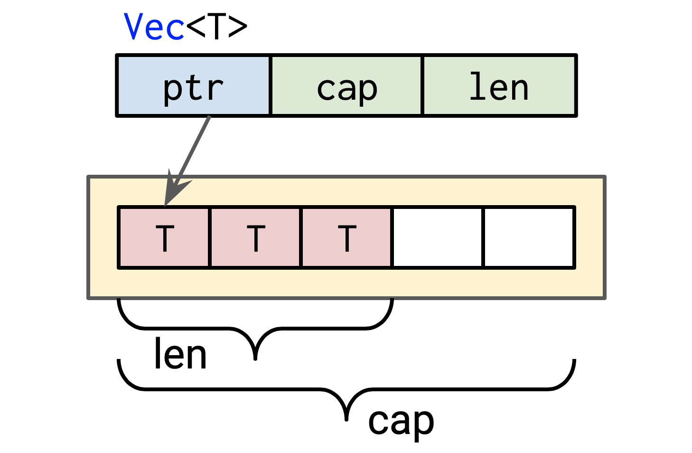

# Learn Rust


Huon Wilson, 2019-08-02

<!--

70% of security vulnerabilities in Microsoft products were due to the
difficulty humans have writing safe C and C++ code. Rust is a
low-level programming language in the same vein that helps the
computer help us write safe code.

I'm Huon, a software engineer on the platform team of the IA or
stellargraph project, and I've got some experience with Rust, so I'm
going to try to help you take some early steps with it.

-->

# My Background

- Data61 (last August). Previously: Apple on Swift, Mozilla on Rust
- Dabbled in many programming languages


# Your Background?

- Rust
- **Low-level** <small>(C, C++, assembly)</small>
- **Statically-typed, functional** <small>(Haskell, F#, Scala, OCaml)</small>
- **Statically-typed, object-oriented** <small>(Java, C#, Swift, Scala)</small>
- **Dynamically-typed, scripting** <small>(Javascript, Python, PHP, Ruby, Shell)</small>
- **Other** <small>(TypeScript, Go, Fortran, R, Matlab, SQL, Lisp (Clojure, Common Lisp))</small>

# Structure

<!--

How are we going to get there? There'll be 3 sets of exercises: first Rust's approach to resource management, then

-->

- ⇒ *Introduction*
- Resource Management (files, memory, mutation)
- Error Handling
-

TODO


# Interlude: Setup

<!--

Before going forward more, let's get things set up, so that can happen
in parallel and everyone is ready when we get to the first exercise soon.

-->
TODO: fill out repo name

``` shell
$ git clone https://github.com/huonw/...
$ cd ...
```

``` shell
$ cargo --version
cargo 1.36.0 (c4fcfb725 2019-05-15)
$ cargo run
...
Hello world
```

[rust-lang.org/tools/install](https://rust-lang.org/tools/install)

(These slides in `slides/`)

# Why Rust?

<!--

MSRC seems to be a formal team designed to deal with security
vulnerabilities in Microsoft products, both retroactively and
proactively. They performed an analysis of Microsoft's CVEs, and
found, consistently, 70% of them were caused by memory safety
problems.

Memory safety is a crucial building block for any other form of
correctness, and violations can result in, at bestm a segfault, or at
worst memory corruption and security vulnerabilities.

For low-level and high-performance programming, C and C++ are typical
choices, and are likely the source of most of those vulnerabilities.

It's very difficult to write safe C and C++ at any scale. This is
despite a plethora of tools now available, such as fuzzers and static
analysers, and is true even with the at a mega-corporation like
Microsoft, that now has consistent and strong investments in software
correctness and safety, such as Haskell and the Midori operating
system.

Rust is designed to be able to solve the same problems as C and C++,
but with memory safety by default, and thus reducing the risk of the
majority of those bugs.

-->


<div style="text-align: right">

&mdash; [Microsoft Security Response Center](https://msrc-blog.microsoft.com/2019/07/16/a-proactive-approach-to-more-secure-code)

</div>


# Buzzwords

<!--

Rust has a lot of good parts, and here's a quick summary of some words
it uses to describe itself.

It has memory safety, and, uniquely, it does this without a garbage
collector, which is how it targets the same problems as C and C++,
so-called "systems programming". It does this through "affine typing",
and also uses this to get some measure of thread safety.

-->

> A language empowering everyone to build reliable and efficient
> software. &mdash; [rust-lang.org](https://rust-lang.org)

- **memory safety**, without a garbage collector
- **affine typing**

# Buzzwords

<!--

Plus, it has a pile of nice things that are common in modern
languages, static types with type inference and algebraic data types,
pattern matching, and generics. It also has hygenic macros,
easy-to-use tooling, and good platform support, including Windows.

All in all, can feel a bit like a blend of C or C++, and Haskell or
OCaml: a low-level language with high-level conveniences.

--->

> A language empowering everyone to build reliable and efficient
> software. &mdash; [rust-lang.org](https://rust-lang.org)

- **memory safety**, without a garbage collector
- **affine typing**

<!-- -->

- systems programming language
- thread safety (no data races)
- no runtime (no garbage collector)
- generics
- algebraic data types
- pattern matching
- type inference
- nice tooling
- good platform support


# The Project: Summarise a CSV file

<!--

I'm going to try to make this as practical as possible. The goal is to
write a little command-line program that will take in a simple CSV
file of numbers, and summarise the columns.

It might look something like this, where the file has two columns,
with headings "year" and "data", and three rows of data. A
summarisation program could tell us the min, mean and max for each of
them.

-->

example.csv:

``` csv
year,data
2019,61
2020,62
2021,9999
```

Your program (maybe):

```
$ cargo run --bin summarise-csv -- example.csv
year: min = 2019, mean = 2020, max = 2021
data: min = 61, mean = 3374, max = 9999
```

# Structure

<!--

How are we going to get there? There'll be 3 sets of exercises: first Rust's approach to resource management, then

-->

- Introduction
- ⇒ *Resource Management (files, memory, mutation)*
- Error Handling
-

TODO


# Resource Management: Good

Lifecycle:

- create/open
- use
- ...
- use
- clean-up/close

# Resource Management: Good

``` rust
// create the resource
file = open("example.csv")

// use it
read(file)
read(file)

// clean up after it
close(file)
```

# Resource Management: Bad

Having to clean up makes life hard

``` rust
file = open("example.csv")
read(file)

// no clean-up
```

``` rust
file = open("example.csv")
close(file)
// use after clean-up
read(file)
```

``` rust
file = open("example.csv")
close(file)
// double clean-up
close(file)
```

# Reading Rust: Functions

``` rust
fn add(x: i32, y: i32) -> i32 {
    x + y
}
```

- `fn` = function
- arguments: `<name> : <type>`
- return type `-> <type>`
- final expression is return value
- integer types: `i` (signed), `u` (unsigned) followed by size in bits

# Reading Rust: Functions

``` rust
fn main() {
    let result = add(1, 2);
    println!("1 + 2 = {}", result);
}
```

- no return type = `-> ()`
- `let` defines variables/name bindings
- `!` = "macro": `println` does work at compile time to be
  type-safe
- `{}` placeholder for value to be formatted
- `;` needed to separate statements

# Scopes

``` rust
use std::fs::File;

fn main() {
    let file = File::open("example.csv").unwrap();

    file.read(...).unwrap();
} // automatically closed at end of scope
```

- always<sup>*</sup> closed
- cannot close twice
- cannot read after close

(`unwrap` = error "handling'.)

# Moves

Resources are values, not bindings.

``` rust
use std::fs::File;

fn open_file() -> File {
    let file = File::open("example.csv").unwrap();
    file
} // not closed, moved as return value

fn main() {
    let file = open_file();
    consume_file(file);
} // not closed, moved into `consume_file`

fn consume_file(file: File) {
    file.read(...).unwrap();
} // automatically closed at end of scope
```

# Exercise

Open

<code class="exercise">src/bin/resource-management.rs</code>

Run using `cargo run --bin resource-management`.

# Moves

``` rust
fn main() {
    let file = open_file();
    consume_file(file); // A

    consume_file(file); // B

}

fn open_file() -> File { ... }

fn consume_file(file: File) { ... }
```

What's going to happen?

# Moves

``` rust
fn main() {
    let file = open_file();
    consume_file(file); // A
    //           ---- value moved here
    consume_file(file); // B: ERROR: use of moved value
    //           ^^^^ value used here after move
}

fn open_file() -> File { ... }

fn consume_file(file: File) { ... }
```

What's going to happen? Compile error.

# Moves

``` rust
fn main() {
    let file = open_file();
    let file2 = consume_file(file); // A
    consume_file(file2); // B
}

fn open_file() -> File { ... }

fn consume_file(file: File) -> File { ... } // C
```

# `&mut`

``` rust
fn main() {
    let mut file = open_file();
    modify__file(&mut file); // A
    modify__file(&mut file); // B
}

fn open_file() -> File { ... }

fn modify__file(file: &mut File) { ... } // C
```

# Moves, more realistic

``` rust
fn main() {
    let file = open_file("data/example.csv");
    let  headings = read_line(file); // A
    let  data_line = read_line(file); // B: ERROR
}

fn open_file(name: &str) -> File { ... }

fn read_line(mut file: File) ->  String { ... } // C
```

# Moves, more realistic

``` rust
fn main() {
    let file = open_file("data/example.csv");
    let (headings, file2) = read_line(file); // A
    let (data_line, _) = read_line(file2); // B
}

fn open_file(name: &str) -> File { ... }

fn read_line(mut file: File) -> (String, File) { ... } // C
```


# `&mut`, more realistic

``` rust
fn main() {
    let mut file = open_file("data/example.csv");
    let  headings = read_line(&mut file); // A
    let  data_line = read_line(&mut file); // B
}

fn open_file(name: &str) -> File { ... }

fn read_line(file: &mut File) -> String { ... } // C
```

# `&mut`

> pure functional programming is an ingenious trick to show you can
> code without mutation, but Rust is an even cleverer trick to show
> you can just have mutation. &mdash;
> [@withoutboats](https://boats.gitlab.io/blog/post/notes-on-a-smaller-rust/)

<br>

<br>

See also: ["In Rust, ordinary vectors are
values"](http://smallcultfollowing.com/babysteps/blog/2018/02/01/in-rust-ordinary-vectors-are-values/),
for mutable interfaces to persistent data structures.

# Memory: C

<!--

In C, you might recall memory is managed via manual calls to `malloc`
to dynamically allocate a new chunk of memory and `free` to clean it
up, and mark that memory as not used. Here I've created a string of
1024 bytes, use it for a bit, and then `free` it. It looks like I've
been reasonably sensible and done it correctly, where all of the uses
are strictly between the create and clean-up.

However, if I got it wrong, or if `do_x` or `do_y` did something a bit
fancy, I would have problems. If I forgot to call `free`, I'd have a
memory leak, annoying but not too bad. If I used the pointer after
`free`ing, I'd have a problem that could lead to memory corruption and
security vulnerabilities. And, the same if I called `free` twice.

This is hard to get right in a complicated program.

-->

``` rust
// create
char *pointer = malloc(1024);

// use
do_x(pointer);
do_y(pointer);

// clean-up
free(pointer);
```

Same problems:

- no clean-up: memory leak
- use after clean-up: **use-after-free vulnerability**
- double clean-up: **double-free vulnerability**

# Memory: Garbage Collection

<!--

We've seen consistently that having to clean up our resources can lead
to problem, so garbage collection or GCs remove the need to clean up
memory. This works great: without needing to call `free`, there's no
way to call it wrong. If a piece of memory is still accessible and so
may be used in future, it won't be cleaned up, so no use-after-free,
and, the GC itself is carefully implemented to only free things once
no double-free!

GCs have, and still do, serve as a great tool for avoiding the worst
memory corruption vulnerabilities. However, they only solve a subset
of memory leaks, and they don't help much with other types of resource
management.

-->

Clean-up happens &#x2728;magically&#x2728;

``` rust
// create
Something obj = new Something;

// use
obj.do_x()
obj.do_y()

// stop using, and clean-up/free will eventually happen
```

# Memory: Rust

Exactly the same as the file resource:

``` rust
fn split_headers() {
    let line: String = "year,data".to_string();

    line.split(',')...
} // end of scope, `line` is freed
```

# Collections: Vectors

``` rust
struct Vec<T> { ... }

let headings: Vec<String> = ...
```

- `<...>` denote generics
- `Vec<T>` = growable vector of an arbitrary type `T`

<details>

``` rust
struct Vec<T> {
    ptr: *mut T, // pointer to allocation, with space for
    cap: usize, // values of type `T`, and the first
    len: usize, // instances are valid
}
```



&mdash; [Rust container cheat sheet](https://docs.google.com/presentation/d/1q-c7UAyrUlM-eZyTo1pd8SZ0qwA_wYxmPZVOQkoDmH4/edit#slide=id.p)

</details>

# Collections: Strings

``` rust
type String = Vec<u8>; // (almost)
```

- growable vector of bytes
- always valid UTF-8


# Extensions

- parallelism: [docs.rs/rayon](https://docs.rs/rayon)
- property testing: [docs.rs/proptest](https://docs.rs/proptest)
- fuzzing: [github.com/rust-fuzz/cargo-fuzz](https://github.com/rust-fuzz/cargo-fuzz/)
